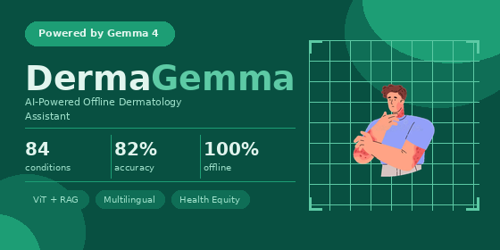

# Dermagemma



### Offline-first dermatology AI for Skin of Color

## The Problem

Modern dermatological AI is trained predominantly on lighter Fitzpatrick skin types (I to III). Conditions like eczema, keloids, hyperpigmentation, and lichen planus present very differently on Fitzpatrick IV to VI skin, and standard models lose roughly 17% diagnostic accuracy on darker skin tones. The result is a systemic bias in clinical AI tools: misdiagnosis, incorrect prescriptions, and prolonged suffering for the patients who most need accurate dermatological assessment.

The problem is compounded by deployment reality. Many of the regions where Skin of Color is the dominant phenotype (sub-Saharan Africa, South Asia, parts of Latin America) also have constrained internet access, intermittent power, and limited clinical infrastructure. A cloud-only AI assistant that requires a stable connection and a hosted GPT-4-class model is useless in those settings.

## How Dermagemma Solves It

Dermagemma is an **offline-first**, fully local multimodal pipeline that runs end-to-end on a CPU laptop with no network connection required after initial setup. It combines:

1. A **fine-tuned Vision Transformer (ViT)** classifier trained with Skin of Color emphasis, covering 84 conditions and reaching 82.2% accuracy on the validation set.
2. A **hybrid RAG retriever** (BM25 + dense embeddings via PubMedBERT, fused with Reciprocal Rank Fusion) over a DermNet NZ knowledge base of 588 entries, with explicit Skin of Color tagging and re-ranking boost.
3. **Gemma 4 E2B-IT** running locally via llama.cpp (Q4_K_M GGUF, ~2.5 GB resident), producing a structured consultation note grounded in the retrieved evidence.
4. **WeasyPrint** for a clean, downloadable PDF clinical chart.

The full inference stack fits in roughly 5 GB of RAM and runs on CPU. No HuggingFace token at runtime, no API keys, no cloud calls. Once the models are downloaded, the whole pipeline works on an airplane.

## ViT Classifier Performance

| Train Loss | Val Loss | Accuracy | F1   | Precision | Recall |
| ---------- | -------- | -------- | ---- | --------- | ------ |
| 0.041      | 0.688    | 82.2%    | 82.0% | 83.0%    | 82.2%  |

## Architecture

```
Input image
   |
   v
ViT classifier (SkinClassifier)         -> top-k predictions + morphology tokens
   |
   v
Hybrid RAG retriever                    -> BM25 + FAISS dense, RRF fused
   (DermatologyRetriever)                  SOC-tagged entries get a relevance boost
   |
   v
Gemma 4 E2B-IT Q4_K_M GGUF              -> structured consultation note
   (GemmaSynthesizer, via llama.cpp)
   |
   v
WeasyPrint PDF (optional)
```

## Setup

### Prerequisites

* Python 3.10+ (developed against 3.12)
* ~6 GB of free disk space for model weights
* No GPU required. A CPU with 8+ GB RAM is enough.

### 1. Clone and create a virtual environment

```bash
git clone https://github.com/saifxyzyz/dermagemma.git
cd dermagemma/vit
python -m venv venv
source venv/bin/activate
```

### 2. Install Python dependencies

The llama-cpp-python package compiles llama.cpp from source by default, which is slow and brittle. Install it from the prebuilt CPU wheel index first, then install the rest:

```bash
pip install llama-cpp-python --extra-index-url https://abetlen.github.io/llama-cpp-python/whl/cpu --prefer-binary
pip install -r requirements.txt
```

### 3. Download the Gemma 4 E2B-IT GGUF

```bash
mkdir -p models
hf download unsloth/gemma-4-E2B-it-GGUF gemma-4-E2B-it-Q4_K_M.gguf --local-dir models/
```

This pulls a single 2.9 GB file into `models/gemma-4-E2B-it-Q4_K_M.gguf`. The Q4_K_M quantization keeps ~95% of the fp32 quality at roughly one fifth the memory.

### 4. Build the knowledge base

`knowledge_base.json` is already committed to the repo. If you want to regenerate it from DermNet NZ:

```bash
python src/scrape_dermnet.py
```

This scrapes ~80 condition pages from DermNet, tags entries that contain Skin of Color content, and writes `knowledge_base.json` at the repo root. Respects a 1.5s delay between requests.

### 5. (Optional) Download the ViT classifier weights

The ViT is loaded from the HuggingFace Hub at `saif0z/vit_skin_classifier` by default and cached locally on first run. If you want to run fully offline from the start, predownload it:

```bash
python -c "from transformers import ViTForImageClassification, ViTImageProcessor; \
ViTForImageClassification.from_pretrained('saif0z/vit_skin_classifier'); \
ViTImageProcessor.from_pretrained('saif0z/vit_skin_classifier')"
```

## Usage

### Single image, CLI

```bash
python main.py test_images/post-inflammatory_hyper_1.jpg
```

### Single image with PDF export

```bash
python main.py test_images/keloids.jpeg --pdf report.pdf
```

### Classification + RAG only (skip the LLM, fastest)

```bash
python main.py test_images/melasma_black_1.webp --skip-llm
```

### Run the full one-image-per-disease test suite

```bash
python main.py --test-all
```

### Gradio web UI

```bash
python app.py
```

Opens at `http://127.0.0.1:7860`. The Gemma synthesizer is loaded lazily on the first request with the "Generate AI consultation note" toggle enabled, so you can run classification + RAG without ever paying the LLM load cost.

To disable Gemma at launch (e.g. on a very memory-constrained machine):

```bash
python app.py --skip-llm
```

## Project Layout

```
vit/
  main.py                      CLI entry point + DermagemmaPipeline class
  app.py                       Gradio UI
  vit.py                       Standalone ViT inference helper
  knowledge_base.json          DermNet NZ KB, 588 entries, SOC-tagged
  models/
    gemma-4-E2B-it-Q4_K_M.gguf Local Gemma weights (not in git)
  src/
    scrape_dermnet.py          DermNet scraper (rebuilds knowledge_base.json)
    web_scraping_script.py     Image dataset scraper (training-time only)
  notebooks/
    gemma4good_RAG_pipeline.ipynb   Original Colab prototype
  test_images/                 One image per disease for the test suite
  requirements.txt
```

## Technical Notes

* **Embedder:** `pritamdeka/S-PubMedBert-MS-MARCO`. PubMedBERT pre-trained on biomedical text, fine-tuned on MS-MARCO for retrieval. Better domain fit than general-purpose embedders for clinical RAG.
* **Embedding cache:** Encoded KB vectors are cached at `.kb_embeddings.npy` keyed by a SHA-1 of the corpus, so the embedder only runs the full encode pass when `knowledge_base.json` actually changes.
* **SOC boost:** Entries tagged `soc_relevant: true` in the KB (either because their section heading matches a Skin of Color pattern or their body contains SOC keywords) get a +0.20 boost in the RRF score, surfacing them ahead of generic content.
* **Local first:** No network calls happen at inference time once weights are cached. The pipeline survives an offline environment.
